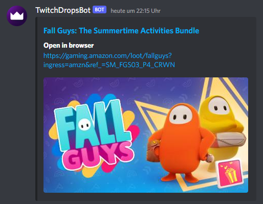
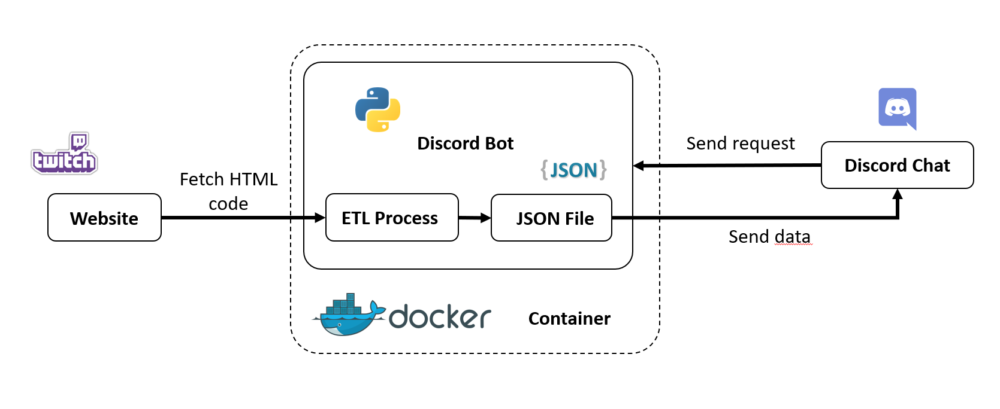

# Loot Bot - Discord Bot for free content on Twitch Prime Gaming and Epic Games

<p>
    <!-- Python --->
    <a href="https://www.python.org" target="_blank" rel="noreferrer"> </a>
    <!-- Discord -->
    <a href="https://discord.com/" target="_blank" rel="noreferrer"> </a>
    <!-- Twitch Prime -->
    <a href="https://gaming.amazon.com/home" target="_blank" rel="noreferrer"> </a>
    <!-- Docker -->
    <a href="https://www.docker.com/" target="_blank" rel="noreferrer"> </a>
</p>

A discord bot to check for available content on Twitch Prime Gaming and Epic Games Store and posting it in the discord 
chat.

### Contents
- [Setup (for non-technical users)](#setup)
  - [Step 1: Setting up a discord bot](#setup1)
  - [Step 2: Running the bot](#setup2)
  - [Step 3: How to use commands in discord chat](#setup3)
- [Screenshots](#screenshots)
- [Technical Design](#design)

<a name="setup"></a>
# Setup (for non-technical users)
<a name="setup1"></a>
### Step 1: Setting up a discord bot
You need to set up a discord bot:
1. Navigate to https://discord.com/developers/applications and create a new application. You can choose whatever name 
fits your need.
2. In your new application, navigate to the section `Bot` and create a bot. You can choose whatever name fits your need. This
name will be the default display name of the bot on your discord server.
3. In your bots settings you will find the `token`. Save it for later steps. This token is important. Keep it always a 
secret!
4. In your application in the section `OAuth2` you will find your `client ID`. With that ID you can invite your new bot to 
your discord server. To do so, navigate to `discordapp.com/oauth2/authorize?client_id=XXXXXXX&scope=bot` but replace 
the "XXXXXXX" with your client ID.
5. After inviting the bot, he will appear in the user list of your server. Yet he will be marked as "offline" but that
will change as soon as you finished the setup and the bot should be running.

<a name="setup2"></a>
### Step 2: Running the bot
To run this bot, it is advised to use Docker. Docker is a way to run programs in a standardized container that works on
any platform. 

Download [Docker](https://www.docker.com/) for your system and start it

Download this repository. For the bot to work, you have to write your bot's token into the config file. The config file 
is located at [bot/ressources/config.yml](bot/ressources/config.yml).
In the section `token`, replace the "O" with your token.

All other parts of the config are optional for you to configure or keep the default settings. However, one important part
to look out for is the section `games_to_inlcude`. Only games listed here will be displayed by the bot in the discord chat.

Open a terminal and navigate into the downloaded directory. Issue the following commands to build and start the docker
container:

```bash
# Build docker image
docker build -t twitch_prime_bot .

# Run docker image as container
docker run -it twitch_prime_bot
```

After starting the container you are finished with the setup.

#### Run without Docker
It is recommended to run this bot in a Docker Container. However, it is also possible to run it without. For that you
need to Download Google Chrome to your system and run the bot.

<a name="setup3"></a>
### Step 3: How to use commands in discord chat
In the discord chat, you can use the commands listed below. All these commands can be changed to any other phrase you like
in the config file.

Make sure the bot has access to the channel you are using. If the bot appears in the user list of that channel, everything
should be set up correctly.

| Command         | Description                                                                                                          |
|-----------------|----------------------------------------------------------------------------------------------------------------------|
| `!twitch`       | Displays current content from the prime gaming website. If available, stored data will be used (max 24h old).        |
| `!twitch fetch` | Displays current content from the prime gaming website. Always tries to fetch new data. This might take longer.      |
| `!epic`         | Displays current content from the epic games store website. If available, stored data will be used (max 24h old).    |
| `!epic fetch`   | Displays current content from the epic games store website. Always tries to fetch new data. This might take longer.  |

<a name="screenshots"></a>
# Screenshots

<p align="center">
    
</p>
<p align="center">
    <i>Example message</i>
</p>

<a name="design"></a>
# Technical Design

<p align="center">
    
</p>
<p align="center">
    <i>Diagram of dataflow from website to Discord chat</i>
</p>

The core of this bot is the functionality to gather data from Amazon Prime Gaming. Since there is no API for this purpose,
this bot fetches the HTML code from the Prime Gaming Website and extracts all relevant data from it. This is mainly done 
by using [Selenium](https://www.selenium.dev/) and [BeautifulSoup](https://beautiful-soup-4.readthedocs.io/en/latest/).

Since fetching new data takes some time, data will be stored locally in a JSON file. New data will first be fetched after
24 hours have passed. This is especially useful when a lot of users use the bot at the same time.

This is wrapped in a discord bot built using the [Discord Python API](https://discordpy.readthedocs.io/en/stable/index.html). The 
discord bot then runs in a Docker container.


# TODO

- Change "via FalyBot" in the embeds
